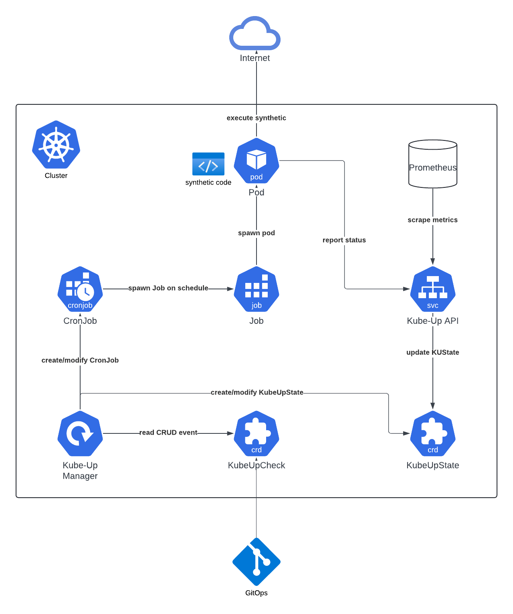

# Kube Up

[](https://opensource.org/licenses/MIT)

A Kubernetes [Operator](https://kubernetes.io/docs/concepts/extend-kubernetes/operator) for running [synthetic checks](https://en.wikipedia.org/wiki/Synthetic_monitoring) using native [Kubernetes CronJobs](https://kubernetes.io/docs/concepts/workloads/controllers/cron-jobs), inspired by [Kuberhealthy](https://github.com/kuberhealthy/kuberhealthy) and built using [kopf](https://github.com/nolar/kopf).

This project is a fork of an internal PitchBook project of the same name that's been in use since Fall of 2023, and is now used for all internal synthetics. It was created to address issues PitchBook faced with other Operator-based frameworks for running synthetic checks, specifically around hitting Kubernetes API rate limits once a certain number of synthetics is reached, as well as the lack of support for custom metrics. This project addresses the former issue by leveraging the Kubernetes `CronJob` resource to run checks, and the latter by exposing a more flexible API and configuration.

## Table of Contents

- [Overview](#overview)
- [Architecture](#architecture)
- [Quick Start](#quick-start)
- [Creating Synthetic Checks](#creating-synthetic-checks)
- [API Reference](#api-reference)
- [CRD Reference](#crd-reference)
- [Prometheus Integration](#prometheus-integration)
- [Development](#development)
- [Contributing](#contributing)

## Overview

Kube Up is a Kubernetes Operator for running synthetic checks (health checks, integration tests, monitoring probes, etc.) using native Kubernetes `CronJob`s. It provides:

- Declarative synthetic checks via `CRD`s
- Automatic scheduling and retries using Kubernetes `CronJob`s
- Centralized status tracking via `KubeUpState` resources and the API
- REST API for result submission and status
- Prometheus metrics for monitoring and alerting with custom metrics support for check-specific measurements (latency, specific failure types, etc.)

## Architecture

### Components

Kube Up consists of three main components:

- **Kube Up Manager** (Python, kopf)
  - Watches `KubeUpCheck` resources
  - Creates and manages `CronJob`s
  - Creates and initializes `KubeUpState` resources
  - Exposes operator metrics for tracking errors

- **Kube Up API** (Python, FastAPI)
  - Receives check results from check pods
  - Updates `KubeUpState` resources
  - Provides status endpoints
  - Exposes Prometheus metrics for all checks

- **Custom Resource Definitions (CRDs)**
  - `KubeUpCheck`: Defines what to check and how often
  - `KubeUpState`: Tracks current status of each check

### Flow



1. User creates `KubeUpCheck` resource
2. Manager detects new `KubeUpCheck` via `kopf` watch and creates:
   - `CronJob` with schedule from `runInterval` and spec from `podSpec`
   - `KubeUpState` resource for status tracking
3. `CronJob` triggers `Job` creation based on schedule
4. `Job` runs check:
   - Executes check logic
   - Collects metrics and results
   - POSTs to Kube Up API at `/synthetics/results`
5. API processes results:
   - Validates pod identity
   - Updates corresponding `KubeUpState`
   - Stores custom metrics
6. Prometheus scrapes API `/metrics` endpoint or users query `/synthetics` endpoint for status

## Quick Start

### Prerequisites

- Kubernetes cluster (v1.20+)
- Helm

### Installation

1. Add the Helm repository:

```bash
helm repo add pitchbook oci://ghcr.io/pitchbook/charts && helm repo update
```

2. Install Kube Up:

```bash
helm install kube-up pitchbook/kube-up \
  --namespace kube-up \
  --create-namespace \
  --set-json 'api.config.extraMetricsLabels=["owner","service","severity"]'
```

3. Verify installation:

```bash
# Check CRDs
kubectl get crd | grep pitchbook.com

# Check Manager and API pods
kubectl get pods -n kube-up

# Check API health
kubectl port-forward -n kube-up svc/kube-up-api 8080:80
curl -i http://localhost:8080/readyz
```

### Creating Your First Check

1. Create a simple synthetic check:

```yaml
# test-check.yaml
apiVersion: pitchbook.com/v1
kind: KubeUpCheck
metadata:
  name: example-check
  namespace: kube-up
spec:
  # How often the check should run, converted to crontab by Manager
  runInterval: 1m
  # Maximum time the check is allowed to run before being considered failed
  timeout: 30s
  # Extra labels that will be appended to metrics
  extraLabels:
    owner: my-team
    service: example-service
    severity: "2"
  # Pod spec that will be run.  All normal pod spec is valid here.
  podSpec:
    containers:
      - name: curl-check
        image: curlimages/curl:latest
        command:
          - /bin/sh
          - -c
          - |
            # Perform health check
            STATUS=$(curl -s -o /dev/null -w "%{http_code}" http://httpbin.org/status/200)
            if [ "${STATUS}" = "200" ]; then
              ok="true"
            else
              ok="false"
            fi

            # Report results
            curl -X POST ${KU_API_URL} \
              -H "Content-Type: application/json" \
              -d "{\"podName\": \"${HOSTNAME}\", \"ok\": ${ok}, \"errors\": [], \"customMetrics\": [{\"name\": \"someMetric\", \"value\": 1, \"labels\": [{\"name\": \"service\", \"value\": \"foo\"}]}, {\"name\": \"someMetric\", \"value\": 0, \"labels\": [{\"name\":\"service\", \"value\":\"bar\"}]}]}"
    restartPolicy: Never
    terminationGracePeriodSeconds: 5
```

2. Apply the check:

```bash
kubectl apply -f test-check.yaml
```

3. Watch the check run:

```bash
# View the KubeUpCheck
kubectl get kucheck example-check -n kube-up

# View the created CronJob
kubectl get cronjob example-check -n kube-up

# View recent Jobs
kubectl get jobs -n kube-up | grep example-check

# View the KubeUpState
kubectl get kustate example-check -n kube-up -o yaml
```

4. Query the status via API:

```bash
kubectl port-forward -n kube-up svc/kube-up-api 8080:80

# Get all check statuses
curl http://localhost:8080/synthetics | jq

# Get Prometheus metrics
curl http://localhost:8080/metrics | grep name=\"example-check\""
```

## Creating Synthetic Checks

### Check Types

Kube Up supports any type of check that can run in a container, for example:

- HTTP/HTTPS checks
- Database checks
- Integration tests
- Certificate validation
- DNS checks
- Data integrity/quality validation
- Cleanup jobs
- SSL certificate expiry checks
- Custom business logic

### Check Container Requirements

Your synthetic check container must:

1. Run your test/validation logic
2. Determine success/failure and gather metrics
3. POST results to `http://kube-up-api.kube-up/synthetics/results`
4. Exit status 0 (to avoid unnecessary retries, API will handle marking the check as failed based on results)

### Result Reporting Format

POST to `/synthetics/results` with:

```json
{
  "ok": true,
  "errors": [],
  "podName": "${HOSTNAME}",
  "customMetrics": [
    {
      "name": "metric_name",
      "value": 123,
      "labels": [{ "name": "label_name", "value": "label_value" }]
    }
  ]
}
```

### Examples

#### Python HTTP Check

```python
import os
import sys
import time
from datetime import datetime

import requests


POD_NAME = os.environ.get("HOSTNAME")
TARGET_URL = os.environ.get("TARGET_URL", "http://httpbin.org/status/200")
API_URL = os.environ.get("KU_API_URL", "http://kube-up-api.kube-up/synthetics/results")


def main():
    results = {
        "ok": True,
        "errors": [],
        "podName": POD_NAME,
        "customMetrics": []
    }

    try:
        start = time.time()
        response = requests.get(TARGET_URL, timeout=10)
        duration_ms = int((time.time() - start) * 1000)
        response.raise_for_status()

        results["customMetrics"].append({
            "name": "response_time_ms",
            "value": duration_ms,
            "labels": []
        })

    except requests.exceptions.RequestException as e:
        results["ok"] = False
        results["errors"].append(str(e))

    try:
        requests.post(API_URL, json=results, timeout=30)
        print(f"Check {'passed' if results['ok'] else 'failed'}")
    except Exception as e:
        print(f"Failed to report results: {e}", file=sys.stderr)
        sys.exit(1)

if __name__ == "__main__":
    main()
```

#### Shell Script Check

```bash
#!/bin/bash
set -eo pipefail

TARGET_URL="${TARGET_URL:-https://httpbin.org/status/200}"
API_URL="${KU_API_URL:-http://kube-up-api.kube-up/synthetics/results}"

# Perform check
START_TIME=$(date +%s%3N)
HTTP_STATUS=$(curl -s -o /dev/null -w "%{http_code}" "$TARGET_URL")
END_TIME=$(date +%s%3N)
DURATION=$((END_TIME - START_TIME))

# Prepare results
if [ "$HTTP_STATUS" = "200" ]; then
    RESULT='{
        "ok": true,
        "errors": [],
        "podName": "${HOSTNAME}"
        "customMetrics": [
            {
                "name": "response_time_ms",
                "value": '"$DURATION"',
                "labels": []
            }
        ]
    }'
else
    RESULT='{
        "ok": false,
        "errors": ["HTTP '"$HTTP_STATUS"'"],
        "customMetrics": []
    }'
fi

# Report results
curl -X POST "$API_URL" \
    -H "Content-Type: application/json" \
    -d "$RESULT"
```

## API Reference

For complete API documentation, see **[API_DOCUMENTATION.md](./documentation/API_DOCUMENTATION.md)**.

### Key Endpoints

| Method | Path                  | Description              |
| ------ | --------------------- | ------------------------ |
| GET    | `/synthetics`         | Get status of all checks |
| POST   | `/synthetics/results` | Submit check results     |
| GET    | `/metrics`            | Prometheus metrics       |
| GET    | `/docs`               | Swagger UI documentation |

## CRD Reference

For complete CRD documentation, see **[MANAGER_DOCUMENTATION.md](./documentation/MANAGER_DOCUMENTATION.md)**.

### `KubeUpCheck`

Defines a synthetic check to run on a schedule.

**Required fields:**

- `spec.runInterval` - How often to run (e.g., "5m")
- `spec.timeout` - Check timeout (e.g., "1m")
- `spec.podSpec` - Container specification

**Optional fields:**

- `spec.extraLabels` - Labels for Prometheus metrics
- `spec.extraAnnotations` - Annotations for resources
- `spec.suspend` - Disable check Cronjob without deleting

### `KubeUpState`

Holds the current status of a check, updated automatically.

**Fields:**

- `spec.ok` - Success/failure status
- `spec.errors` - Error messages
- `spec.lastRun` - Timestamp of last run
- `spec.runDuration` - How long the check took
- `spec.customMetrics` - Custom metrics from check

## Prometheus Integration

### Metrics Exposed

The Kube Up API exposes the following metrics at `/metrics`:

- `kubeup_check{name, namespace, <extraLabels>}`
  - Type: Gauge
  - Values: 1 (success) or 0 (failure)
  - Description: Current status of the check

- `kubeup_check_duration_seconds{name, namespace, <extraLabels>}`
  - Type: Gauge
  - Values: Seconds
  - Description: Duration of last check run

If the config includes custom metrics, they will be exported like so:

- `kubeup_check_custom_<metric_name>{name, namespace, <extraLabels>, <customLabels>}`
  - Type: Gauge
  - Values: User-defined
  - Description: Custom metrics reported by checks

### Example Queries

```promql
# All failing checks
kubeup_check == 0

# Average check duration by service
avg by (service) (kubeup_check_duration_seconds)

# Custom metric: average response time by service
avg by (service) (kubeup_check_custom_response_time_ms)

# Checks taking longer than 30 seconds
kubeup_check_duration_seconds > 30
```

### Example Alerting Rules

```yaml
apiVersion: monitoring.coreos.com/v1
kind: PrometheusRule
metadata:
  name: example-rules
  namespace: kube-up
spec:
  groups:
    - name: kube_up_alerts
      interval: 30s
      rules:
        - alert: SyntheticCheckFailing
          expr: kubeup_check == 0
          for: 5m
          labels:
            severity: "{{ $labels.severity }}"
          annotations:
            summary: "Synthetic check {{ $labels.name }} is failing"
            description: "Check {{ $labels.name }} in {{ $labels.namespace }} has been failing for 5 minutes"
        - alert: SyntheticCheckSlow
          expr: kubeup_check_duration_seconds > 60
          for: 15m
          labels:
            severity: warning
          annotations:
            summary: "Synthetic check {{ $labels.name }} is slow"
            description: "Check {{ $labels.name }} is taking over 60 seconds to complete"
```

## Development

### Local

```bash
uv sync
uvx prek install
```

### Testing

See **[testing](./testing/README.md)** for instructions on running the full stack locally with Skaffold.

## Best Practices

### Resource Management

- Always set resource requests and limits
- Use appropriate timeout values

### Error Handling

- Implement retry logic in check containers
- Report detailed error messages

### Metrics

- Include any labels necessary for filtering/grouping
- Use consistent labels across related checks
- Report meaningful custom metrics

### Security

- Store credentials in Kubernetes Secrets
- Don't log sensitive information

### Monitoring

- Create alerts for failing checks
- Monitor check duration trends
- Alert on stale checks
- Use severity labels for prioritization and routing

## Contributing

We welcome contributions! Please see [CONTRIBUTING.md](./CONTRIBUTING.md) for guidelines, including information about the Developer Certificate of Origin (DCO) sign-off requirement.

## Links

- [API reference](./documentation/API_DOCUMENTATION.md)
- [Manager/CRD reference](./documentation/MANAGER_DOCUMENTATION.md)
- [Local testing](./testing/README.md)
